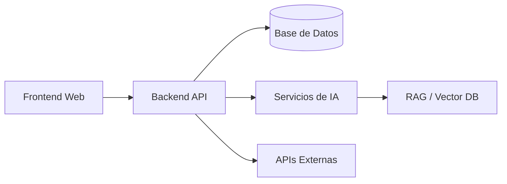

# Plan Técnico – Plataforma de Inversiones con IA

## Metadatos de Registro
Feature: 001-plataforma-inversiones-ia  
Referencia: SPEC-001 (Baseline canónica Speckit)  
Tipo: Technical Plan  
Uso previsto: Entrada directa para /speckit.plan  
Estado: Propuesto  
Framework: Spec-Driven Development (Speckit)

---

## 1. Objetivo

Definir el plan técnico de implementación de la Plataforma de Inversiones con IA descrita en la SPEC-001, estableciendo arquitectura, fases, componentes y entregables técnicos necesarios para que Speckit genere el plan oficial ejecutable.

Este documento describe únicamente el “cómo” técnico y no redefine ni amplía el alcance funcional definido en la especificación canónica.

---

## 2. Alcance

Incluye:
- Arquitectura técnica de alto nivel
- Componentes del sistema y sus responsabilidades
- Fases de implementación técnica
- Integración de capacidades de inteligencia artificial
- Entregables técnicos verificables
- Identificación de riesgos técnicos y mitigaciones

Excluye:
- Historias de usuario
- Escenarios funcionales detallados
- Criterios de aceptación de negocio
- Diseño UX/UI final

---

## 3. Supuestos Técnicos

- La SPEC-001 es la única fuente canónica y no se modifica.
- Se adopta una arquitectura modular orientada a servicios.
- La IA actúa como asistente y motor analítico, no como decisor autónomo.
- El sistema debe poder evolucionar sin reescrituras mayores.
- Se prioriza trazabilidad, observabilidad y control de costos de IA.

---

## 4. Arquitectura Técnica (Alto Nivel)

### 4.1 Diagrama Lógico

### 4.2 Componentes y Responsabilidades

Frontend Web:
- Interfaz de usuario
- Visualización de inversiones y métricas
- Dashboards y reportes
- Interacción con el asistente de IA

Backend API:
- Lógica de negocio
- Orquestación de servicios
- Autenticación y autorización
- Exposición de endpoints seguros

Base de Datos:
- Persistencia de usuarios
- Información de inversiones
- Métricas históricas
- Trazabilidad y auditoría

Servicios de IA:
- Análisis de datos financieros
- Generación de recomendaciones
- Resúmenes y reportes automáticos
- Asistencia conversacional

RAG / Vector Database:
- Almacenamiento de contexto documental
- Datos históricos relevantes
- Reducción de costos de inferencia
- Mejora de precisión de respuestas IA

APIs Externas:
- Datos financieros
- Indicadores de mercado
- Información complementaria externa

## 5. Fases de Implementación

Fase 1 – Fundaciones Técnicas

Objetivo:
Establecer la base estructural del sistema.
Entregables:

- Estructura de repositorio
- Backend y frontend inicializados
- Conexión a base de datos
- Autenticación básica

Tareas:
- Setup del proyecto
- Configuración de entornos
- Definición inicial de esquemas
- Endpoints base y health checks

Fase 2 – Núcleo de Inversiones

Objetivo:
Gestionar información central de inversiones.

Entregables:
- Operaciones CRUD de inversiones
- Modelos de datos validados
- Servicios de cálculo base

Tareas:
- Modelado de entidades
- Validaciones de datos
- Persistencia optimizada
- Logging y trazabilidad

Fase 3 – Integración de Inteligencia Artificial

Objetivo:
Incorporar capacidades inteligentes al sistema.

Entregables:
- Agente de análisis de inversiones
- Motor de recomendaciones
- Chat IA contextual

Tareas:
- Integración con proveedor LLM
- Implementación de RAG
- Versionado de prompts
- Control de costos de inferencia

Fase 4 – Visualización y Reportes

Objetivo:
Explotar los datos y resultados del sistema.

Entregables:
- Dashboards financieros
- Reportes automáticos
- Visualizaciones clave

Tareas:
- Gráficas y métricas
- Exportación de reportes
- Optimización de performance

Fase 5 – Seguridad y Escalabilidad

Objetivo:
Preparar el sistema para uso real y crecimiento.

Entregables:
- Roles y permisos
- Auditoría básica
- Observabilidad

Tareas:
- Autorización por roles
- Protección de endpoints
- Métricas y alertas
- Pruebas técnicas

## 6. Agentes de IA

Agent Analyzer:
- Analiza datos financieros
- Detecta patrones y tendencias

Agent Recommender:
- Sugiere acciones de inversión
- Explica fundamentos de las recomendaciones

Agent Reporter:
- Genera reportes y resúmenes
- Produce vistas ejecutivas

Agent Guardian:
- Valida consistencia
- Identifica riesgos y anomalías

## 7. Consideraciones Técnicas

Seguridad:
- No se permiten decisiones automáticas sin supervisión
- Registro completo de prompts y respuestas
- Acceso controlado a datos sensibles

Costos de IA:
- Límites de tokens por operación
- Cacheo de respuestas
- Uso intensivo de RAG para reducir inferencia

Escalabilidad:
- Arquitectura desacoplada
- Servicios de IA intercambiables
- Preparación para futuras plataformas

## 8. Riesgos y Mitigación

Dependencia excesiva de IA
Mitigación: Fallbacks determinísticos

Costos elevados de inferencia
Mitigación: Monitoreo y límites

Ambigüedad funcional
Mitigación: Uso de specs derivadas

Crecimiento desordenado
Mitigación: Modularidad estricta

## 9. Estado de Preparación

SPEC-001 registrada como baseline canónica
Plan técnico alineado sin inferencias funcionales
Compatible con checklist Speckit
Listo para generación de plan oficial

## 10. Acción
Este documento se utiliza directamente como entrada para:
/speckit.plan

## 11. Nota Final
Este plan técnico preserva completamente la fuente canónica y define únicamente la estrategia de implementación.
Cualquier ampliación funcional deberá realizarse mediante specs derivadas, manteniendo la integridad del baseline.
